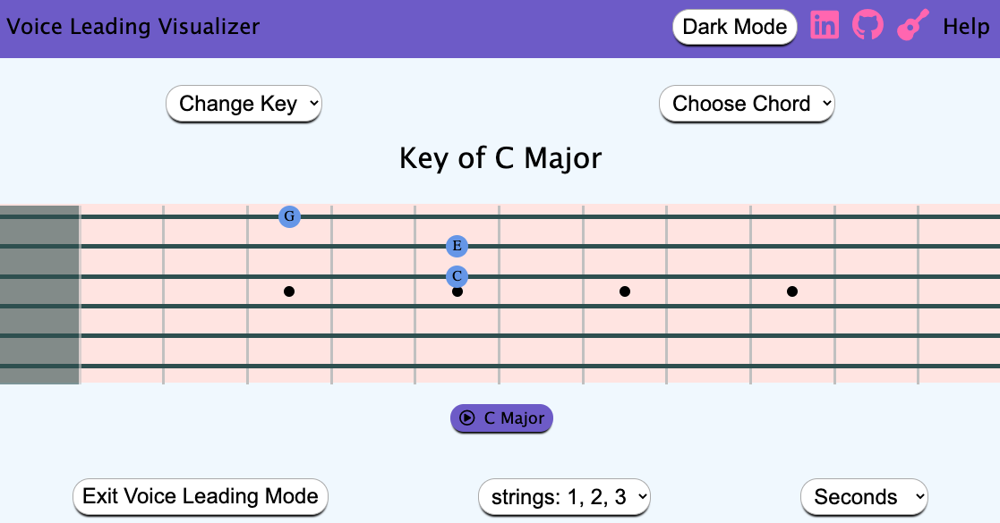

Overview: 
To understand this project, we must first understand voice leading. Good 
    voice leading in music is the technique of changing chords as 
    efficiently as possible. First, know that a chord in music is comprised of 
    multiple notes played simulataneously. Take C major for instance. When you 
    play C major, you're really playing the notes C, E, and G. E minor is E, G,
    and B. Many guitarists will jump all over their instrument to go from C to G,
    when really, they only have to change one single note! (CEG --> BEG). 

This app will provide a practice tool for guitarists to learn notes all over 
    the fretboard so that they can smoothly transition between chords with as 
    little movement as possible. This will make them better solo players, and 
    much better band members as they will no longer be stepping on the musical
    toes of what the other musicians are playing. 
    
    
     

In Voice Leading Visualizer users will be able to:
1. Input two chords and see all the different ways to smoothly move from one 
    note to the next on the fretboard.

2. Input a key and see how to travel from any chord in that key to any other 
    chord in that key.

3. Input many chords (perhaps the chords of a song) and PLAY ALONG with the 
    visualized changes at a speed of your choosing. 

4. Input many chords (perhaps the chords of a song) and see a visualization of 
    efficient ways of playing those chords.

In addition, this project will include:
1. the project will contain reading materials on what makes for "good" voice 
    leading. There will be tips on when to follow traditional voice leading and 
    when to break the rules.

2. If I can find good youtube tutorials/demonstrations of voice leading in
    action, linking those would be a great motivator for students.

3. A README for any curious programmers

* Home will reset the page to where the mode (play along, scales, etc.) is selected. This leads to a cascade of choices (key, chords, etc.) that eventually lead to the page we're on now. 
* The key drop down and chord drop down allow the user to change options without navigating away from the current view.
* If the user is in play along mode, this page will automatically update with the next chord at the speed the user chooses on the metronome input at the bottom.

__________________________________________________________________________________________
This project will be implemented with the following technologies:

* Canvas to render the game board.
* Webpack to bundle and transpile JavaScript code.
* npm to manage project dependencies.

__________________________________________________________________________________________
Project timeline:

* research different methods to display a dynamic guitar fretboard. (Canvas?) and get various chords and shapes showing up on the screen and animating to a new chord without reloading the page.

* Monday: Implement all of the logic that chooses what is the most efficient chord shape to transfer to. 

* Tuesday: Tie the logic to the front end so the page can send two chords and animate the most efficient transition between the two.

* Wednesday: Make everything look beautiful, add audio. Have all of my musician friends break the code by stress testing it.

__________________________________________________________________________________________
Looking forward:

* I would love to expand this past guitar to include other chordal instruments. Simply by displaying sheet music of the chords so we're seeing the actual notes on the staff.

* Perhaps pull from a database of thousands of songs and chords so that users can find songs that they want to learn and the chords show up automatically and they can play along.